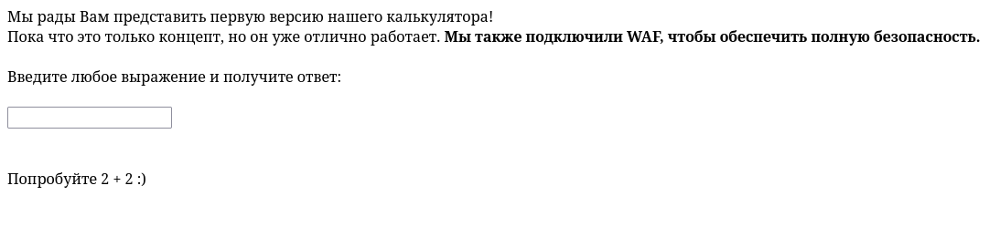

# Калькулятор

Изначально дана лишь ссылка на ресурс и описание без чётких подсказок.

После захода на ресурс, можно прочитать, что он использует WAF. Протестируем разные способы для удалённого исполнения кода.

При попытке получить файлы в директории с помощью `__import__('os').popen('ls').read()` (для Python) получаем ошибку от WAF.

Попробуем иным способ получить находящиеся в директории папки и файлы. Также, попробуем использовать уязвимости PHP, а не Python.

При попытке использования `system('ls')` мы также получаем ошибку. Попробуем ещё один способ

В случае использования `` `ls` `` у нас получает получить необходимое. Теперь мы выведем файл `index.php` с помощью утилиты `cat`.

Флаг находится в конце файла `index.php` в комментарии
