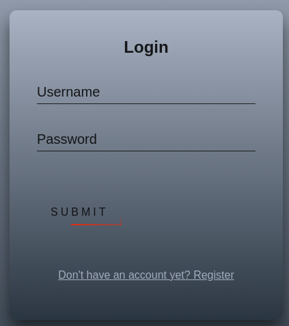

# Запретный код

Описание: Воображение важнее, чем знания
Таск встречает нас окном входа в аккаунт

Был зарегистрирован новый аккаунт для проверки работы сайта. После этого нас встречает страница с неудачными попытками входа в аккаунт

После этого, таблица была заполнена примерами неудачных попыток

Из всех возможных полей возможно подменить лишь поле User-Agent, т.к. оно полностью приходит с клиента. Я попробовал вставить туда XSS с простейшим JavaScript-скриптом `alert('test123')`

Попытка добавить XSS оказалась успешной и скрипт выполнился

После этого был написан скрипт для отправки cookie-файла на вебхук с сайта [Webhook.site](https://webhook.site)

Далее, были получены кукисы админа

После, с помощью изменения запроса в Burp Suite был получен флаг

