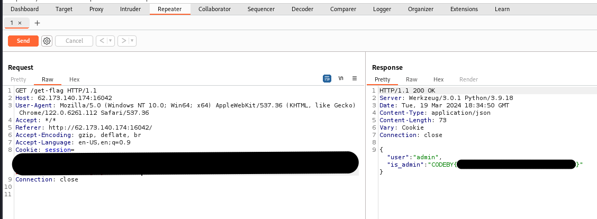

# Привилегированный гость

Описание: Видные люди в гостях не засиживаются
Изначально таск встречает нас эмулятором терминала

В терминале были изучены доступные команды с помощью help

Среди доступных команд были найдены интересующие нас команды: whoami и getFlag. Далее, был проверен вывод обеих команд

После использования команд были изучены запросы в Burp Suite. В них замечено, что для хранения данных о пользователе используются куки

Далее, с помощью расширения Wappalyzer были просмотрены технологии, которые предположительно использует сайт

В Wappalyzer видно, что сайт, предположительно, использует Flask на бекенде. С помощью данных с сайта [HackTricks](https://book.hacktricks.xyz/network-services-pentesting/pentesting-web/flask) были изучены способы декодирования и подделки куки-файлов. Сначала куки-файл был декодирован на [предложенном сайте](https://www.kirsle.net/wizards/flask-session.cgi)

После декодирования куки стало ясно, как именно происходит проверка пользователя - предположительно, сервер проверяет поле `_user_id`. Далее, с помощью утилиты [flask-unsign](https://pypi.org/project/flask-unsign/) и словаря rockyou был подобран пароль, используемый для кодирования куки

Далее, с помощью этой же утилиты был закодирован новый куки-файл, где вместо старого `_user_id` установлен `admin`

После этого, с помощью инструменты Repeater в Burp Suite был получен флаг

